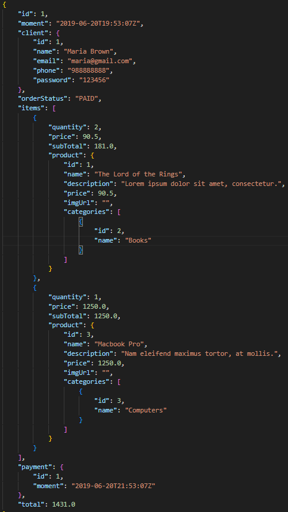
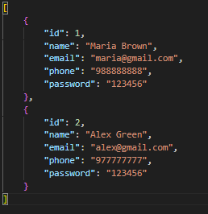
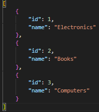
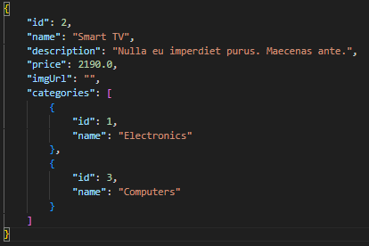

# SpringWeb Project

## Overview

This project is a Spring Boot application designed to manage various entities such as Users, Orders, Categories, and Products. It leverages Spring Data JPA for database interactions and follows a RESTful architecture for API endpoints. 

- The application is structured into different logical layers: resource, service, and repository. 
- Uses H2 as an in-memory database.
- Supports Create, Retrieve, Update, and Delete operations for the User entity.
- Implements personalized exception handling to manage errors, with different error messages and HTTP responses.

## Quick Access

- [Getting Started](#getting-started)
- [Project Structure](#project-structure)
- [Endpoints](#endpoints)
- [Running Tests](#running-tests)
- [Build and Deployment](#build-and-deployment)

## Getting Started

### Pre-requisites

- Spring Boot 3.3.4 or higher
- Java 21 or higher
- Maven 3.9.9 or higher

### Installation

1. Use spring initializr to start a base project with the above requisites.

2. Marven dependencies in pom.xml
    ```xml
    <dependency>
        <groupId>org.springframework.boot</groupId>
        <artifactId>spring-boot-starter-web</artifactId>
    </dependency>

    <dependency>
        <groupId>org.springframework.boot</groupId>
        <artifactId>spring-boot-starter-test</artifactId>
        <scope>test</scope>
    </dependency>
    <dependency>
        <groupId>org.springframework.boot</groupId>
        <artifactId>spring-boot-starter-data-jpa</artifactId>
    </dependency>
    <dependency>
        <groupId>com.h2database</groupId>
        <artifactId>h2</artifactId>
        <scope>runtime</scope>
    </dependency>
    ```

3. Clone the repository:
    ```sh
    git clone <repository>
    cd Spring-Project
    ```

2. Build the project using Maven:
    ```sh
    ./mvnw clean install
    ```

3. Run the application:
    ```sh
    ./mvnw spring-boot:run
    ```

## Project Structure

```plaintext
src/
├── main/
│   ├── java/
│   │   └── com/firstspring/project/
│   │       ├── config/
│   │       ├── entities/
│   │       ├── repositories/
│   │       ├── resources/
│   │       ├── services/
│   │       └── ProjectApplication.java
│   └── resources/
│       ├── application-test.properties
│       └── application.properties
│
└── .mvn/
    └── wrapper/
        └── maven-wrapper.properties
```

## Endpoints

### User Resource

- `GET /users` - Returns all users
- `GET /users/{id}` - Returns a user by ID
- `POST /users` - Create a new user
- `PUT /users/{id}` - Update an existing user
- `DELETE /users/{id}` - Delete a user

### Category Resource

- `GET /categories` - Returns all categories
- `GET /categories/{id}` - Returns a category by ID

### Order Resource

- `GET /order` - Returns all orders
- `GET /order/{id}` - Returns a order by ID

### Product Resource

- `GET /products` - Returns all products
- `GET /products/{id}` - Returns a product by ID

## Build and Deployment
Build the project with:
```sh
./mvnw clean package
```

The generated JAR file will be located in the `target` directory, for me it was **project-0.0.1-SNAPSHOT.jar**. You can run it using:
```sh
java -jar target/your-jar-file.jar
```
### Examples returned by the API using Postman:
- GET /order/1



- GET /users



- GET /categories



- GET /categories/2


